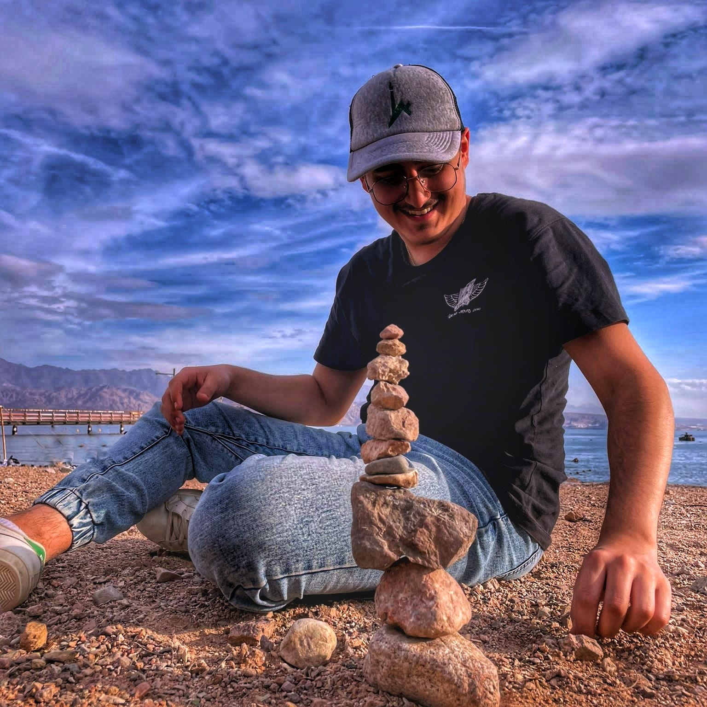

# Portofilo

Hi! my name is Shimon israel pur.  
In this repo you can find some projects i did and my resume.

## Server:
---
Basic multithreded server with state machine, json and sqlite database written in C# language. 
Project include GUI version of the console based server for more comfortable control.

## RecepieApp
---
client based of the ServerCS project, written with c#.NET and with wpf.  
## SudokuSolver
---
Simple console based suduku solver, written in c language.

## Tic-Tac-Toe
---
Simple console based Tic-Tac-Toe game, written in c language.